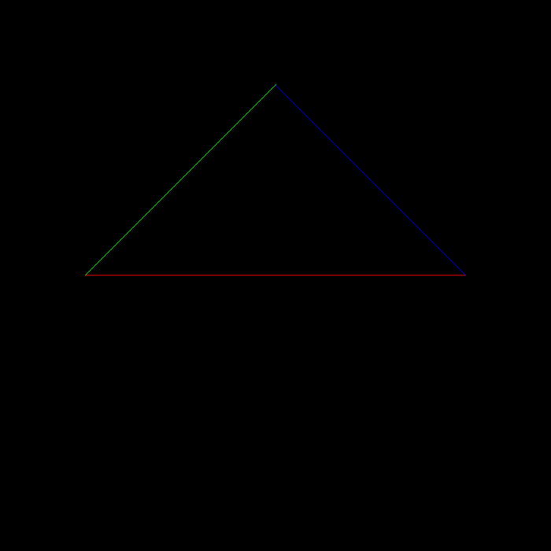
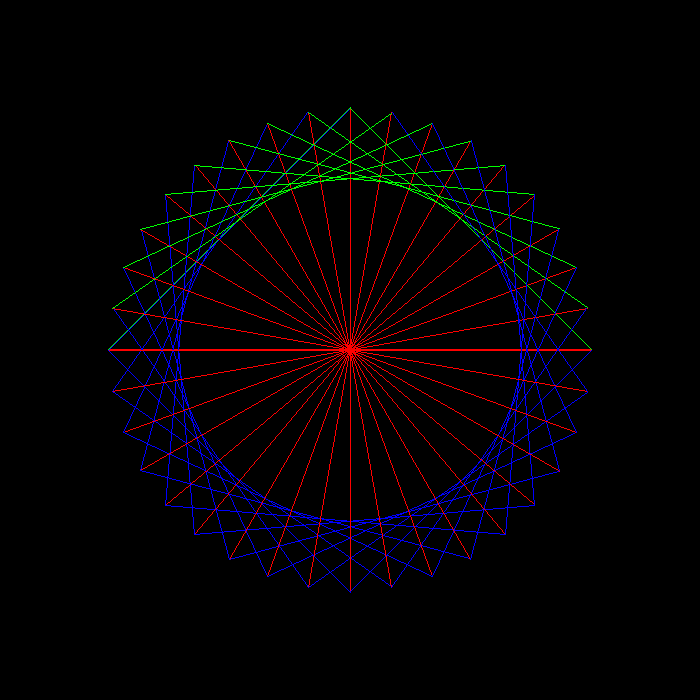

# GAMES101

GAMES101: 现代计算机图形学入门 Rust实现的作业，目前使用以下第三方库

* [glam-rs](https://github.com/bitshifter/glam-rs)：线性代数库
* [image-rs](https://github.com/image-rs/image)：图片编码器与解码器

图片展示使用 `kitty` 的 `icat` 命令，非 `kitty` 终端下运行会报错

## 作业1

## TODO

